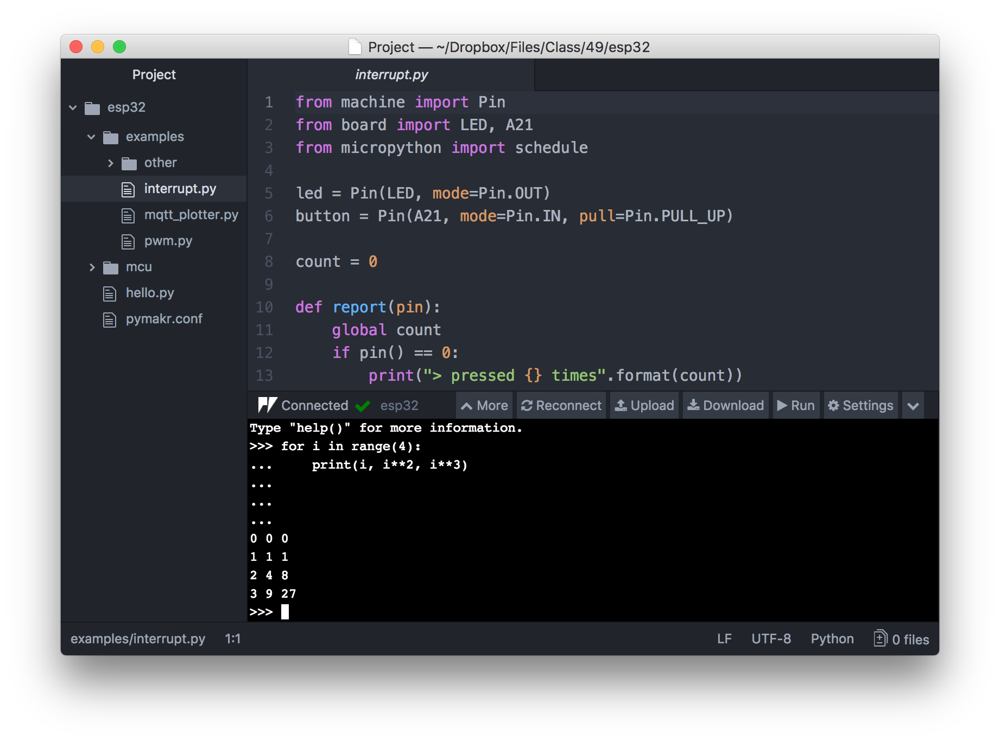
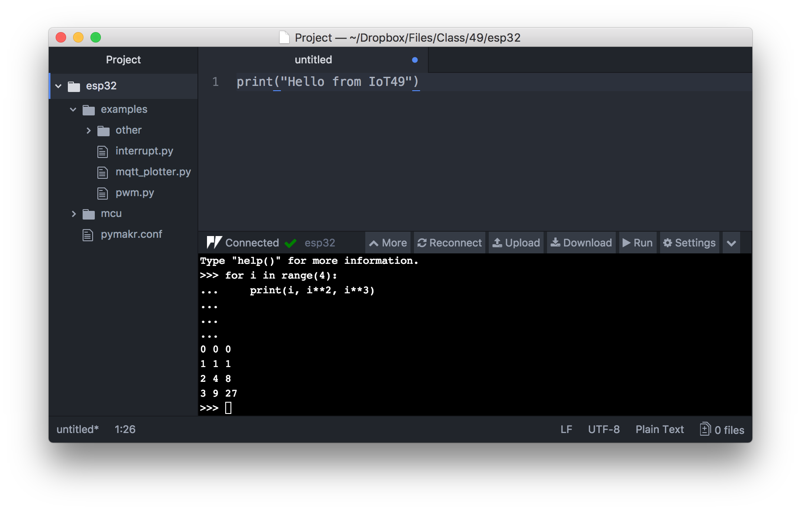
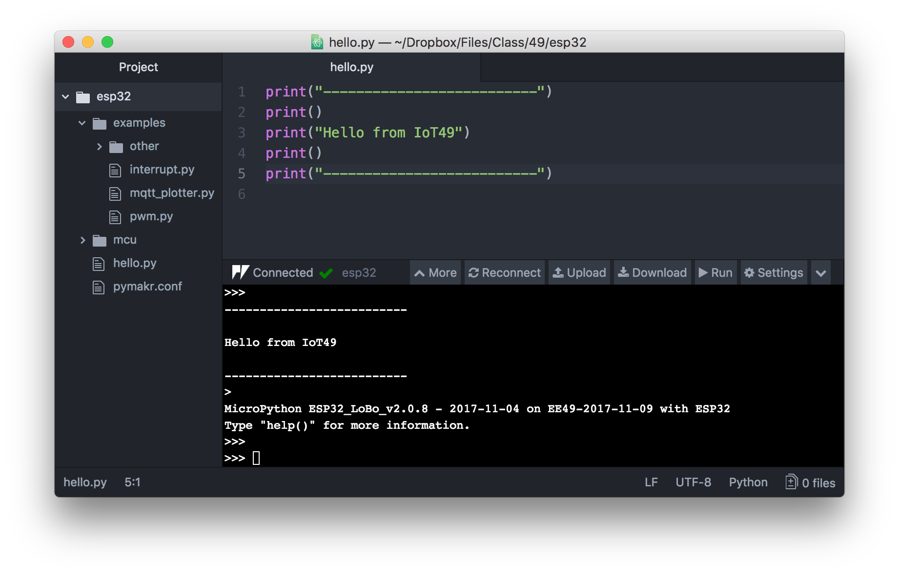

# Atom IDE

## Editor Window

The figure shows the Atom IDE with the project file browser at the left (menu `File->Project Folder...` and navigate to the `IoT49/esp32` folder if it is not open), the editing pane at the top right, and the ESP32 REPL console at the bottom right.

## REPL

Commands typed into the REPL console are sent the the ESP32 for execution and results returned to the console for display.

Click `Connect` or `Reconnect` if the REPL prompt (`>>>`) is not displayed. Sometimes it is necessary to press the reset button on the ESP32 and wait ~10 seconds before a connection can be made.

## Editor & Running Code

Clicking on a file in the browser opens an editor window. Choose `File->New File...` and type a few Python commands into the blank editor window.

Click `File->Save` and enter a suitable name and extension **.py**.

Make sure the editor window with the code you just typed is selected (you may need to click inside the window) and then click the `Run` button above the REPL window. The code is uploaded and executed on the ESP32 and results sent back for display in the console.

## Uploading Library Files

The command `sync.py` typed in a termial window or at the Window command prompt uploads the contents of the `mcu` folder to the `/flash` folder on the ESP32. 

`mcu` contains initialization code `boot.py` executed each time the ESP32 resets, the application `main.py` (invoked after `boot.py` finishes; the default is just a stub that does nothing), the and the user library `lib`, and any other content you may wish the upload (e.g. html pages for a webserver). Be mindful that the ESP32 flash memory available for user files is only ~500 kBytes.

Exit the `Atom IDE` and run `sync.py` whenever you make changes to the `mcu` folder. Currently the ESP32 must be connected via its USB port for `sync.py` to work. Reset the ESP32 after uploading code to clear stale content.