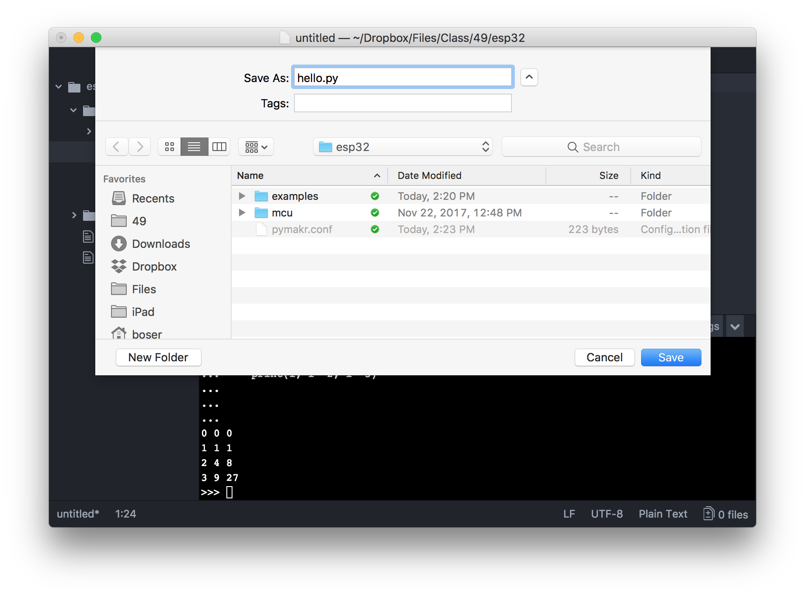

# Atom IDE

## Editor Window

Create a folder where you want to keep the programs for the ESP32. Then start the Atom editor, choose `File->Project Folder...` and navigate to the folder you just created. The figure above shows the IDE with the project file browser at the left with a few program files already created, the editing pane at the top right, and the ESP32 REPL console at the bottom right.

## REPL

Commands typed into the REPL console are sent the the ESP32 for execution and results returned to the console for display.

Click `Settings->Project Settings` and change the value of the `"address"` field the name of the USB port on your computer.

Click `Connect` or `Reconnect` if the REPL prompt (`>>>`) is not displayed. Sometimes it is necessary to press the reset button on the ESP32 and wait a few seconds before a connection is made.

## Editor & Running Code

Clicking on a file in the browser opens an editor window. Choose `File->New File...` and type a few Python commands into the blank editor window.

Click `File->Save` and enter a suitable name and extension **.py**.

Make sure the editor window with the code you just typed is selected (you may need to click inside the window) and then click the `Run` button above the REPL window. The code is uploaded and executed on the ESP32 and results sent back for display in the console.

