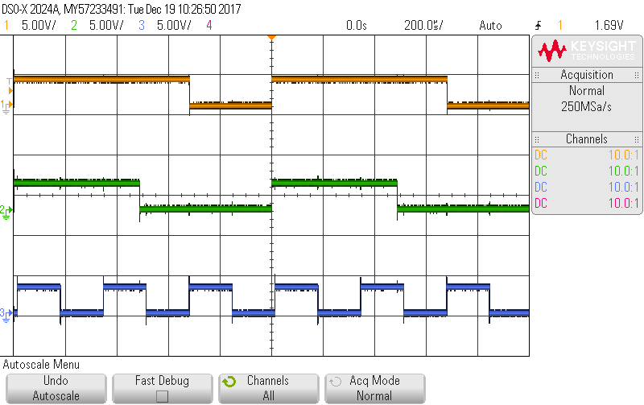

# Digital GPIO

* [Output](#output)
* [Input](#input)
* PWM
* Interrupts

## <a name="output">Output</a>

All pins named A0 ... A21 **except `A2, A3, A4`** can be used for digital output.

### Standard Output
In standard mode, the pin is driven to GND (0V) or VDD (3.3V) depending on its state.

```python
from machine import Pin
p = Pin(id, mode=Pin.OUT)
p(0)   # pin driven to 0V
p(1)   # pin driven to VDD (~ 3.3V)

```
`id` is the name of the pin, e.g. 

```python
from board import A0
from machine import Pin
p = Pin(A0, mode=Pin.OUT)
```

### Open Drain Output
When configured as open drain, a pin is pulled low (tied to GND) when set to `0`, and open when set to `1`.

```python
from machine import Pin
p = Pin(id, mode=Pin.OPEN_DRAIN)
p(0)   # pin driven to 0V
p(1)   # pin open (not driven)

```
`id` is the name of the pin, e.g. `A0`.

## <a name="input">Input</a>
All pins named A0 ... A21 can be configured for digital input.

```python
from machine import Pin
p = Pin(id, mode=Pin.IN)
p()   # 0 if voltage is close to 0V
      # 1 if voltage is close to VDD (3.3V)

```
`id` is the name of the pin, e.g. `A0`.

Optionally, a pull-up or pull-down resistor can be enabled on the pin. This feature is not available on pins `A2, A3, A4`.

```python
from machine import Pin
p = Pin(id, mode=Pin.IN, pull=<None|Pin.PULL_UP|Pin.PULL_DOWN>)
```

For example,

```python
from board import A21
from machine import Pin
p = Pin(A21, mode=Pin.IN, pull=Pin.PULL_UP)
```
configures pin `A21` as an input and connectes a pull-up resistor between the input pin and VDD.

The values of the pull-down and pull-up resistors vary from chip-to-chip and pin-to-pin and are tpically 30 ... 80 kOhm (pull-up) and ~17 kOhm (pull-down).

## PWM

Pins can be configured to output a square wave without further CPU intervention.

Example: 

```python
from machine import PWM, Pin
from board import *
import time

# declare pins
pin1 = Pin(A18, mode=Pin.OUT)
pin2 = Pin(A19, mode=Pin.OUT)

# initialize PWM
pwm1 = PWM(pin1, freq=1000)
pwm2 = PWM(pin2, freq=1000)

# set duty cycle (0 ... 1023)
pwm1.duty(300)
pwm2.duty(700)

# go about other business (or just take a nap)
time.sleep(10000)

# release PWM circuitry for later reuse
pwm1.deinit()
pwm2.deinit()
```

Oscilloscope screen shot:



## Interrupts

Digital inputs can be configured to call a Python function whenever the value changes.

```python
from machine import Pin
p = Pin(id, mode=Pin.IN, ...)
p.irq(handler, trigger=< Pin.IRQ_FALLING | Pin.IRQ_RISING >)
```

`trigger` may be either `Pin.IRQ_FALLING`, `Pin.IRQ_RISING` or `Pin.IRQ_FALLING | Pin.IRQ_RISING` causing the handler to be called when the input changes from `1 to 0`, `0 to 1`, or in either direction.

`handler` is a Python function with one argument (the `pin` that caused the interrrupt). E.g.

```python
def irq_handler(pin):
    pass
```

Code in interrupt handlers must be short and not allocate memory (e.g. no floating point arithmetic, print statements, or manipulating lists). If any of these features are required or for longer computations, use the `schedule` function. Example:

```python
from machine import Pin
from board import LED, A21
from micropython import schedule

led = Pin(LED, mode=Pin.OUT)

# connect a button between pin A21 and GND
button = Pin(A21, mode=Pin.IN, pull=Pin.PULL_UP)

# number of times button was pressed
count = 0

# extended code (print) called from interrupt
def report(pin):
    global count
    if pin() == 0:
        print("> pressed {} times".format(count))
    else:
        print("         < released {} times".format(count))

# interrupt handler
def button_irq_handler(button):
    global count
    if button() == 0: count += 1
    led(1-button())
    # no printing or memory allocation in interrupt handler
    # schedule for later execution (outside interrupt)
    schedule(report, button)

# attach interrupt handler to button pin
button.irq(button_irq_handler, trigger=Pin.IRQ_FALLING | Pin.IRQ_RISING)

# interrupts occur in the background (concurrent with REPL)
print("Return control to REPL; interrupts continue in background")
``` 

Consult the MicroPython manual for more information about [writing interrupt handlers](http://docs.micropython.org/en/latest/pyboard/reference/isr_rules.html).