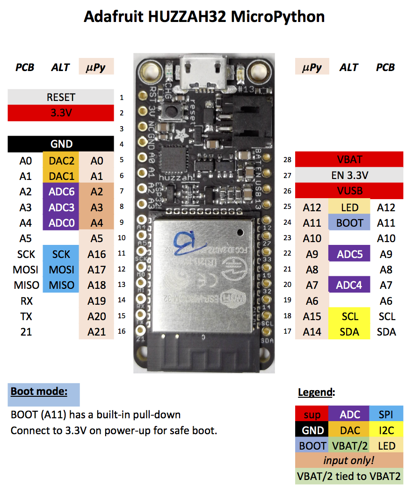

# GPIO

The figure below shows the pin naming of the MicroPython port for the Huzzah32. Module `boot` declares all pin names.

E.g. the following code turns on red LED on the Huzzah32 board:

```python
from board import LED
from machine import Pin

led = Pin(LED, mode=Pin.OUT)
led(1)
```

Follow these links for details on [digital](digital.md) and [analog](analog.md) input and output.

