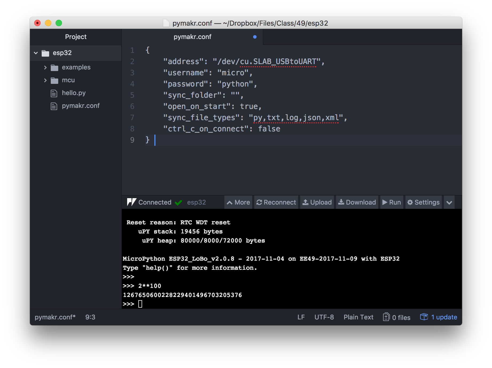

# Install the uPython Programming Environment

These instructions have been tested on *macOS Sierra* Version 10.12.6 and Windows 10. The installation on Linux is similar with a few changes depending on the version of Linux you are using.

Read the entire document before starting the installation. 

## 1) Install the USB Driver

Download and install the CP210X USB driver from [https://www.silabs.com/products/development-tools/software/usb-to-uart-bridge-vcp-drivers](https://www.silabs.com/products/development-tools/software/usb-to-uart-bridge-vcp-drivers). 

**Important:** For later steps you will need to know the name of the port of the USB device. To find out what it is, connect the ESP32 microcontroller to a free USB port. 

### OSX/Linux

Open a terminal window (search `Terminal` from the command bar and click on the appropriate result) and type `ls /dev` at the prompt. You will be presented with a long list of device names. The one you are looking for likely contains the string `USB`. Try `ls /dev/*USB*` to get a list of only those devices. Likely the name you are looking for is `/dev/cu.SLAB_USBtoUART` (`/dev/ttyUSB0` on Linux). Unplug the ESP32 and run `ls /dev/*USB*` again. If the device is no longer present in the listing it is the one you are looking for.

**Linux:** On Linux, the user may need to be added to the dialout group to have access to the USB port without being root. E.g. on Ubuntu, run `sudo usermod -a -G dialout $USER`.

### Windows

To find out what the USB (also called COM-port on Windows) is, open the Windows `Device Manager`. Click the Windows button (typically in the lower left of the corner of the screen) and type `device` in the search box. Click `Device Manager`. Connect the ESP32 microcontroller to a free USB port. Then open the tab `Ports (COM & LPT)` in the device manager. Look for the line starting with `Silicon Labs CP210x`. The port you are looking for is listed in parantheses at the end of the line, e.g. `COM3`. Take note of this value, you will need it to program the microcontroller. 

Be sure to always connect the ESP32 to the same physical USB port as the port number may be different for other connectors. The port number can also change when other devices are plugged into different USB ports. If in doubt or in case of problems you can always repeat the steps outlined above to check if the USB port has changed.

### Note

Installing drivers requires typically *Administrator Privileges*. On the EECS IoT49 Lab computers the USB driver has already been installed for you.


## 2) Install Python 3

Determine if Python is already installed. Open a terminal/command window and type:

```
python --version
```

If you get something similar to

```
Python 3.6.3 :: Anaconda custom (x86_64)
```

Python is already installed. The number after the word `Python` is the version. Verify that it is `3.4` or later. If not, you need to install a newer version. In particular OSX and many versions of Linux come with Python 2.7 preinstalled. 

Fortunately it is possible to install multiple versions of Python without them interacting. Download and install [Python 3.6](https://conda.io/miniconda.html) from [https://conda.io/miniconda.html](https://conda.io/miniconda.html). Other Python 3 distributions should work as well.

Open a terminal window and type `python` at the prompt. Verify that Python announces itself with the correct version (3.6). Type `exit()` to quit the Python interpreter.

## 3) Install `shell49`

Navigate to [https://github.com/bboser/shell49]() and follow the instructions to install `shell49`.

## 4) Flash the MicroPython Firmware to the ESP32

Connect the ESP32 to the computer via USB. At the command prompt type

```
shell49
```

After the greeting the commands below. Replace `<port>` with the USB port determined in step 1 of these instructions, e.g. `/dev/cu.SLAB_USBtoUART` and `<alphanumeric_name>` with a unique name, e.g. `donald_duck` if your name is Donald Duck.

```
config --default port <port>
config --default board HUZZAH32
config --default time_offset 0
flash
config -u name <alphanumeric_name>
```

If you did not get any error messages, your microcontroller is ready for work. Type

```
repl
```

and try a few Python commands, e.g.

```
1+1
2**100
for i in range(4):
    print(i, i**2)
```

Type `Ctrl-X` followed by `Ctrl-D` to exit `shell49`.

## 6) Get a Text Editor

To write programs you need a text editor. Any plain text editor works (e.g. `TextEdit` or `Notepad`), but an editor with Python syntax highlighting helps catching errors. 

A [web search](https://wiki.python.org/moin/PythonEditors) brings up many options. If you are already with an editor, use that. 

If you prefer an ```Integrated Programming Environment (IDE)``` which  keeps track of your project, you might consider [Atom Editor](https://atom.io). It has a plugin that [talks directly to boards with MicroPython](atom_ide.md). See [https://docs.pycom.io/chapter/pymakr/installation/atom.html]() for more information.



