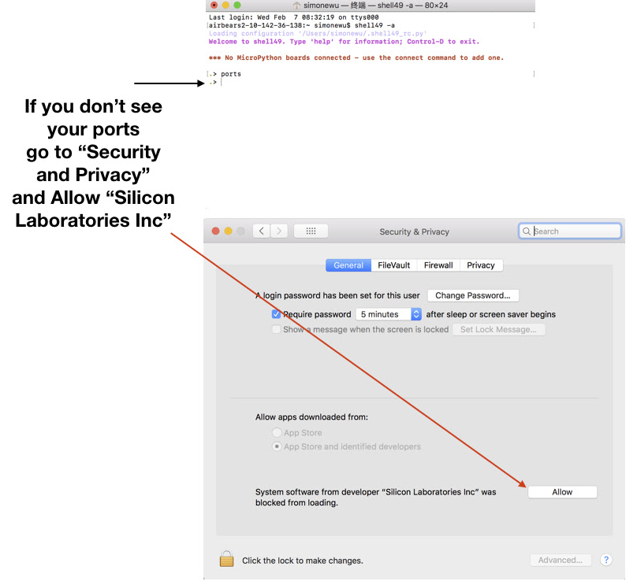

## Enabling the USB Port

On some operating systems, USB driver access must be explicitly enabled.

### OSX

On the majority of Mac OSX installations, the USB driver works out of the box.

Only some systems with restrictive permission settings, block the driver from loading. If the USB driver is installed, but the `shell49` `ports`-command does not show the port, you may need to allow access, as shown in the figure below. Access the `Security & Privacy` settings from `Preferences`.



### Linux

On Linux, it may be necessary to add the user to the `dialout group` by executing the following command at the terminal prompt:

```
sudo adduser user_name dialout
```

Replace `user_name` with your user name. Search the web for additional information.
