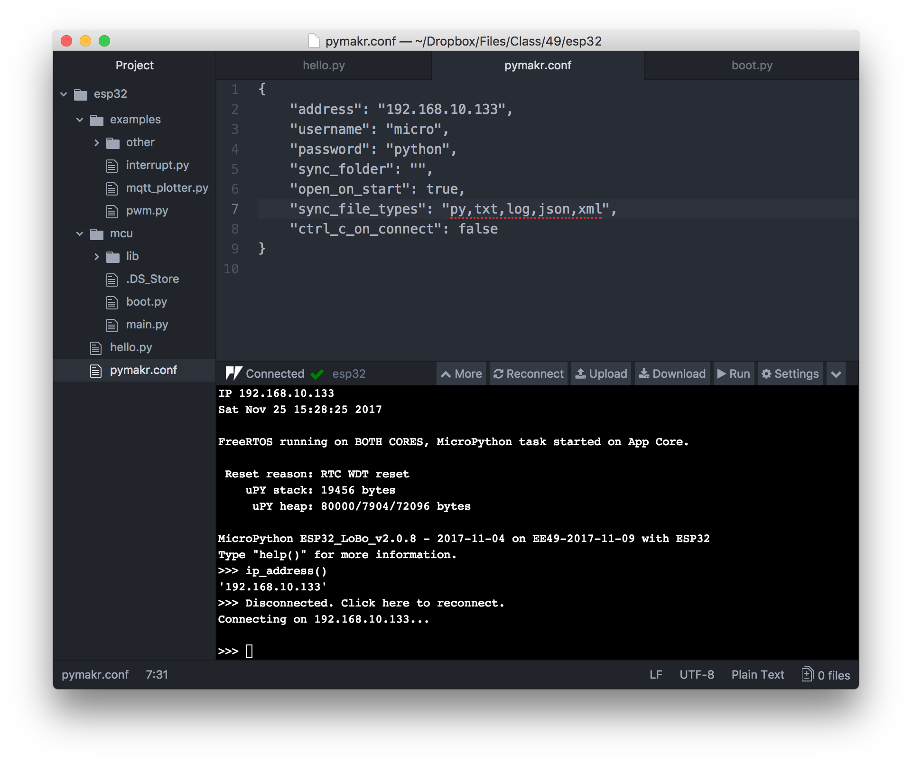

# WiFi

## Setup

The file `mcu/boot.py` is executed every time the ESP32 boots and contains the code for connecting the the wireless LAN (WiFi).

* To connect to a password connected network (e.g. at your home), add the SSID and password of your network to `known_wifi_nets` in file `mcu/boot.py`. The screen shot below shows an example for a net with SSID `home-SSID` and password `my_very_secret_password`.
* Connecting to the EECS-PSK network requires registering the device. To do so you need the `MAC address` of your ESP32. Type `mac_address()` at the REPL prompt. The text displayed between quotes is the MAC address (e.g. `30:ae:a4:30:81:a8`). Navigate to [https://iris.eecs.berkeley.edu/db/network](https://iris.eecs.berkeley.edu/db/network/) and click the link `Register a Device`. Enter sensible responses to the questions asked (e.g. `your_name_esp32` for device name, and `other` for type of device and operating system). Service tpically starts after one business.

Do not forget to run `sync.py` to upload the edited `boot.py` to the ESP32!

## Firewall

Some WiFi setups or host computers use a firewall which may have to be configured. We will be using the following ports:

    | Service | Port number
    +---------+------------
    | telnet  | 23
    | ftp     | 21
    | mqtt    | 1883, 8883
    | http    | 80, 443
    
If the ESP32 is not able to connect (e.g. to the MQTT boker), or the host cannot connect to the ESP32 (e.g. the Atom console), it may be a firewall issue. Please contact the network administrator for assistance.

## Programming the ESP32 over WiFi

Once the credentials are entered in `boot.py` and wireless service has started, you can configure the Atom IDE to wirelessly program the ESP32. This is very convenient if the microcontroller is in a difficult to reach location e.g. on a moving robot or buried inside a machine.

Reboot the ESP32 and type `ip_address()` at the REPL prompt. The string between quotes is the address you are looking for.

Then click `Settings->Project Settings` in the toolbar above the REPL window and enter it as the value of the `address`, like so:

Click `File->Save` and Reconnect. The ESP32 is now connected over WiFi. You can verify this by disconnecting from the computer and instead powering the board from a LiPo battery.

After establishing the wireless connection, `boot.py` instructs the ESP32 to fetch the current time from the internet. If only my kitchen range was this clever ...
