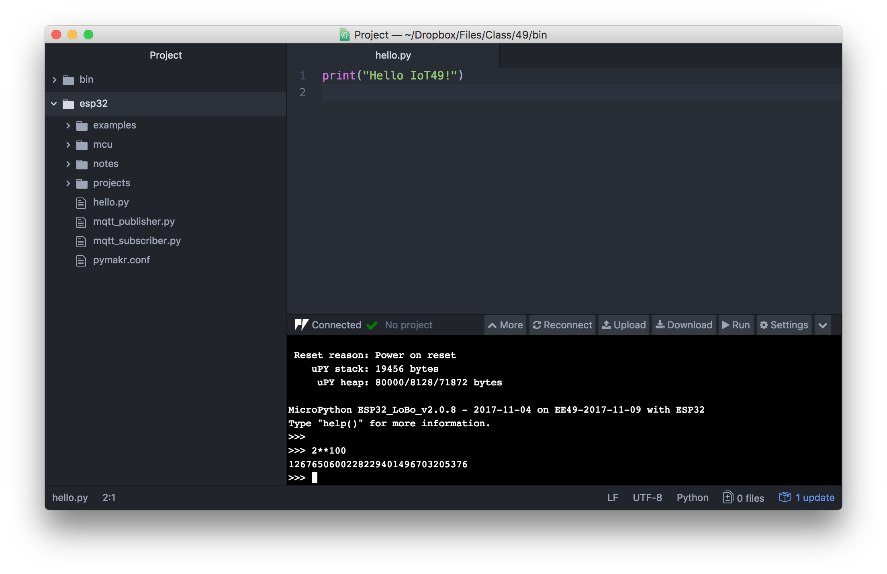

# Install the uPython Programming Environment on Windows

These instructions have been tested on *Windows 10 Pro* Version 16.07 and may need modifications on other versions of Windows. Read the entire document before starting the install.

## 1) Install the USB Driver

Download and install the CP210X USB driver from [https://www.silabs.com/products/development-tools/software/usb-to-uart-bridge-vcp-drivers](https://www.silabs.com/products/development-tools/software/usb-to-uart-bridge-vcp-drivers). Choose the default version (not the one with Serial Enumeration).

**Important:** For later steps you will need to know the `COM` port of the USB device. To find out what it is, open the Windows `Device Manager`. Click the Windows button (typically in the lower left of the corner of the screen) and type `device` in the search box. Click `Device Manager`. Connect the ESP32 microcontroller to a free USB port. Then open the tab `Ports (COM & LPT)` in the device manager. Look for the line starting with `Silicon Labs CP210x`. The port you are looking for is listed in parantheses at the end of the line, e.g. `COM3`. Take not of this value, you will need it in step 4 of this guide and later to program the microcontroller. 

Be sure to always connect the ESP32 to the same physical USB port as the port number may be different for other connectors. If in doubt or in case of problems you can always repeat the steps outlined above to check if the USB port has changed.

Installing drivers requires *Administrator Privileges*. On the EECS IoT49 Lab computers the USB driver has already been installed for you.

## 2) Install Python 3

Download and install [Python 3.6](https://www.python.org) from [https://www.python.org](https://www.python.org).

In the installer window, make sure that `Install launcher` and `Add Python 3.6 to PATH` are checked.

Bring up a Command Prompt (click the Windows or Start button, type `cmd` and click `Command Prompt`).

At the command prompt type `python`. Verify that Python announces itself with the correct version (3.6). Type `exit()` to quit the Python interpreter.

Back at the Windows Command Prompt, issue the following instructions to install additional packages:

```
pip install pyserial
pip install matplotlib
```

## 3) Download the Programming Environment

Install `git` from [https://git-for-windows.github.io](https://git-for-windows.github.io). Accept the default options.

Click the Windows button and type `git` in the search field. Click on `Git Bash`. In the window that opens type the following command:

```
git clone https://github.com/bboser/IoT49.git
cd IoT49
pwd
```

This downloads the `IoT49 MicroPython programming environment` to the hard drive of your computer and prints the path where it is installed (e.g. `C:\Users\joe\IoT49`). Take a note of this path, you will need it in step 4 below.

**Updates:** If you ever need to update the environment, open a `Git Bash` window and enter the following commands:

```
cd IoT49
git pull
git submodule update --init --recursive
``` 

## 4) Update the Command Search Path

Click the Windows button and type `env`, then click `Edit environment variables for your account`.

Under `User variables for ...`, select `Path` and click `Edit...`. Click new and enter the path where you copied the IoT49 Programming Environment, followed by `\bin`. E.g. `C:\Users\joe\IoT49\bin`. Click `OK`.

Fill in the correct values of your path to the `IoT49 folder` and the COM port in the table below. The value for `PYTHONPATH` is the path to your IoT49 folder with `\bin\lib` appended. Do not use the example values, they are most likely incorrect for your setup. Back to the screen showing `User variables for ...`, select `New` to create the following environment variables:

Variable      | Value                                        | Example 
------------- | ---------------------------------------------|------
IOT49         | ............................................ | C:\Users\joe\IoT49
PYTHONPATH    | ............................................ | C:\Users\joe\IoT49\bin\lib
RSHELL_PORT   | ............................................ | COM3

Hit `OK` a couple of times to quit the variable editor. Close and reopen all Command Prompt Windows to update them to the new environment you just set.

## 5) Flash the MicroPython Firmware to the ESP32

Connect the ESP32 to the computer via USB. Open a Windows `Command Prompt` and type 

```
flash.py
sync.py
```

The first command installs the MicroPython interpreter on the ESP32. `sync.py` copies Python library files to the microcontroller. You also use this program to upload Python code you wrote. If you get a warning from `flash.py` that the firmware could not be installed, try running the command again. If the problem persists, unplug and replug the ESP32 or try a different USB port or computer. Following the instructions in step 1 above, verify that that COM port number is still correct and update the `RSHELL_PORT` environment variable if it has changed.

You can also erase the entire flash of the microcontroller (if something bad happens, e.g. you flashed a program with an infinite loop) by executing `erase_flash.py` from the `Command Prompt`.

**Warning:** Only one USB connection can be active. You may need to quit the Atom IDE (see next section) before using `flash.py` and `sync.py`.

## 6) Install the Atom Editor

Download and install the [Atom Editor](https://atom.io) from [https://atom.io](https://atom.io). Once installed, start the editor by clicking on the green icon on the desktop. Choose `File->Settings` and click on `+ Install`. Search for `pymakr`. Scroll down to the package with name `Pymakr` in click the install button. 

From `File` choose `Add Projects Folder...`. Navigate to `C:\Users\joe\IoT49\esp32` and click `Select Folder`.

After `Pymakr` is downloaded and installed, the MicroPython command window appears near the bottom of the Atom IDE. Click `Settings->Project Settings` and edit the value of the field `"address"` to match the USB port the ESP32 is connected to, e.g.

```
"address": "COM3",
```
if the USB port you determined in step 1 above is `COM3`. Click `Connect`. 

If all goes well, the ESP32 announces itself by printing the version  (e.g. `IoT49-2017-11-12`) and other details about the installed firmware. 

The `>>>` is the MicroPython prompt. Commands you type here are sent to the ESP32 for execution and the results displayed back here. Try `5-9` or `for i in range(5): print(i**2)`. Have fun exploring!



